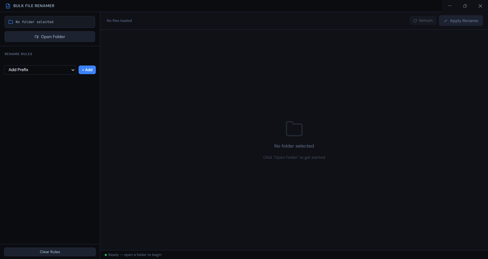
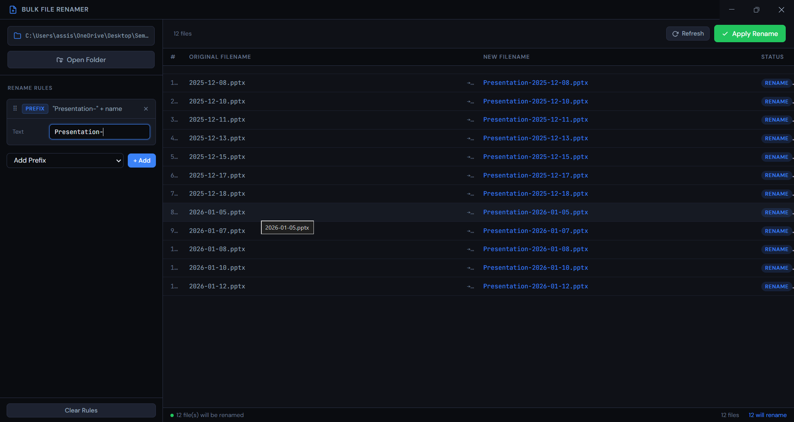

# Bulk File Renamer

A professional desktop application for advanced bulk file renaming built using **Electron (Node.js + HTML + CSS + JavaScript)**.

## ✨ Features

* Live rename preview
* Rule chaining system
* Prefix / suffix renaming
* Find & replace (text & regex)
* Sequential numbering
* Case conversion
* Extension rename
* Date-based renaming
* Undo last rename
* Collision-safe two-phase renaming
* Modern dark UI

## 🖥 Tech Stack

* Electron
* Node.js
* JavaScript
* HTML & CSS
* NSIS Installer

## 📦 Installation

Download the latest installer from the **Releases** section.

## 🚀 Development

```bash
npm install
npm start
```

## 🏗 Build Installer

```bash
npm run build:win
```

## 📸 Screenshots

### Main Interface


### Rename Preview


## 📄 License

MIT License
